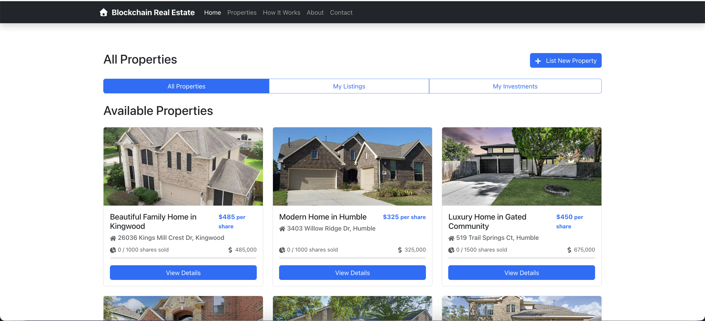

# 🏠 Blockchain Real Estate Platform

A decentralized real estate investment platform that enables fractional ownership of properties using blockchain technology. This platform allows users to buy and sell shares of real estate properties as non-fungible tokens (NFTs), making real estate investment more accessible and liquid.

  
  
<em>Blockchain Real Estate Platform - Modern Web Interface</em>

## ✨ Features

### 🏗️ Property Management

- List new properties with detailed information and high-quality images
- Fractional ownership through tokenization with ERC-20 tokens
- View comprehensive property details, ownership history, and transaction records
- Advanced search and filter properties by location, price, size, and property type
- Track available shares and investment progress in real-time
- Property features and amenities tracking
- Built-in image gallery with support for multiple property images

### 👥 User Authentication & Security

- Secure user registration and login with JWT authentication
- Seamless wallet integration (MetaMask)
- User profile management with portfolio tracking
- Transaction history with blockchain verification
- Role-based access control (Admin, Property Lister, Investor)
- Secure password hashing and session management

### 💰 Investment & Trading

- Purchase fractional shares of properties with secure transactions
- Real-time portfolio tracking and investment performance analytics
- Detailed ownership dashboard showing stakes across multiple properties
- Secure blockchain transactions with smart contract verification
- Transaction history with blockchain transaction hashes
- Automatic calculation of ownership percentages
- Investment progress tracking with visual indicators

### 📱 Modern Web Interface

- Fully responsive design optimized for all devices
- Interactive property listings with image galleries and virtual tours
- Real-time updates on property status, ownership, and market value
- Intuitive dashboard with portfolio analytics and performance metrics
- Interactive charts and visualizations for investment tracking
- Dark/Light mode support for better user experience
- Accessibility features for better usability

## 🛠️ Tech Stack

### Frontend

- React.js
- Context API for state management
- Web3.js for blockchain interaction
- Bootstrap 5 for responsive design
- Axios for API requests

### Backend

- Node.js with Express for API development
- MongoDB with Mongoose for flexible data modeling
- JWT for secure authentication
- Web3.js and Ethers.js for blockchain interaction
- Express Validator for request validation
- Winston for comprehensive logging
- Rate limiting and security middleware
- API documentation with Swagger/OpenAPI

### Blockchain

- Ethereum smart contracts written in Solidity
- FractionalToken (ERC-20) for property shares
- PropertyNFT (ERC-721) for unique property representation
- OpenZeppelin contracts for security and standards compliance
- Truffle Suite for development and testing
- Ganache for local blockchain development
- Smart contract events for real-time updates
- Gas optimization for cost-effective transactions

## 🚀 Getting Started

### Prerequisites

- Node.js (v14 or later)
- npm or yarn
- MongoDB
- Ganache (for local development)
- MetaMask browser extension

## 📚 Smart Contracts

### FractionalToken.sol

- ERC-20 compatible token for fractional property ownership
- Implements OpenZeppelin's ERC20 and Ownable contracts
- Features:
  - Customizable token name and symbol
  - Decimal support for precise share division
  - Transfer restrictions and whitelisting
  - Pausable functionality for emergency stops
  - Role-based access control
  - Events for all major operations

### PropertyNFT.sol

- ERC-721 non-fungible token for unique property representation
- Implements OpenZeppelin's ERC721 and ERC721URIStorage
- Features:

  - Unique token IDs for each property
  - Metadata storage with IPFS support
  - Ownership history tracking
  - Integration with FractionalToken for share management
  - Batch operations for efficiency
  - Real-time transaction tracking

  ### Frontend

  - Enhanced property search with advanced filters
  - Mobile responsiveness
  - Performance optimizations for faster loading
  - Portfolio analytics dashboard
  - User profile management
  - Transaction history with blockchain verification

## 📧 Contact

For any questions, feedback, or support, please reach out to [randall.ridley@gmail.com](mailto:randall.ridley@gmail.com)

## 🤝 Contributing

Contributions are welcome! Please feel free to submit a Pull Request.

## 📄 License

This project is licensed under the MIT License - see the [LICENSE](LICENSE) file for details.

---
