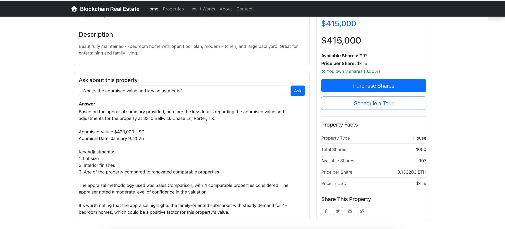

# 🤖 AWS Bedrock RAG Testing Guide

<div align="center">
  
  <p><em>Blockchain Real Estate Platform - Modern Web Interface</em></p>
</div>

> Quick Start
>
> 1. Upload docs to S3: `s3://realestate-rag-docs/properties/<propertyId>/...`
> 2. Create Bedrock Knowledge Base, add S3 data source, run sync, copy KB ID
> 3. Backend env: `AWS_REGION`, `KNOWLEDGE_BASE_ID` (optional Guardrails/Model)
> 4. Run backend and test via cURL or the Property page Q&A

This guide explains how to test the AI Q&A feature powered by Amazon Bedrock with Retrieval Augmented Generation (RAG), what documents it searches, and the value this feature adds to the platform.

## 🎯 What This Feature Does

- Answers property-specific questions in plain English.
- Grounds responses in your own documents (RAG) and returns citations.
- Reduces risk of hallucinations by retrieving relevant snippets first, then asking the model to answer using those snippets.
- Works even without RAG (falls back to structured property JSON), but RAG improves factuality and utility.

## 💎 Value Add

- **Trust & Transparency**: Answers come with sources so investors can verify claims.
- **Speed to Insight**: Users can ask natural questions (e.g., "What were the recent repairs?") and get concise, useful summaries.
- **Scalable Content**: Drop in new docs per property (disclosures, maintenance logs, etc.), sync the Knowledge Base, and answers automatically improve.
- **Consistency**: Standardized document structure and metadata keep responses consistent across properties.

## 🧱 High-Level Architecture

- Frontend: `PropertyAIChat` component on the Property Detail page calls `POST /api/ai/ask`.
- Backend: If `KNOWLEDGE_BASE_ID` is set, Bedrock Knowledge Bases retrieves top-K snippets. Backend then prompts Claude 3.5 with:
  - Structured property JSON summary
  - Retrieved document snippets (when RAG on)
  - User question
- Response: Returns `answer` and `citations` (source URIs) to the UI.

## 📂 Document Types Searched (Per Property)

RAG considers any files you upload under the property’s S3 folder. Recommended types:

- Disclosures: `disclosure-YYYY.txt`
- Inspection: `inspection-summary.txt`
- Neighborhood: `neighborhood-overview.md`
- Appraisal: `appraisal-summary.txt`
- Comps: `comps-overview.md`
- Maintenance: `maintenance-log-YYYY.md`
- Roof: `roof-status.txt`
- Pest/Termite: `pest-inspection-summary.txt`
- HVAC: `hvac-overview.txt`
- Energy: `energy-efficiency.md`
- Insurance: `insurance-notes.md`
- Flood/Storm: `flood-storm-risk.txt`
- Permits/Renovations: `permits-renovations.md`
- Safety: `safety-checklist.txt`
- Seasonal Maintenance: `seasonal-maintenance-plan.md`
- Photo Captions: `photo-captions.md`

Each file can include YAML front matter to improve context clarity, for example:

```
---
propertyId: <id>
docType: inspection
title: Inspection Summary - <Property Title>
city: <City>
state: <State>
address: "<Full Address>"
---
```

## 🪪 What Questions Are Best Supported?

- "Summarize key risks for this property."
- "What repairs or maintenance were done recently?"
- "What’s the roof condition and expected remaining life?"
- "What comparable sales support this price?"
- "Any flood or storm risk I should know about?"
- "What are typical utilities and energy efficiency notes?"

## 🧰 Setup Steps

1. Prerequisites

- AWS Bedrock enabled in your region (e.g., `us-west-2`).
- Permissions: `bedrock:InvokeModel`, `bedrock:Retrieve`, S3 read for your bucket.

2. Document Layout

- Recommended S3 paths:
  - `s3://realestate-rag-docs/properties/<propertyId>/...`
- Local samples included here:
  - `sample-listings/docs/properties/<propertyId>/...`

3. Create a Bedrock Knowledge Base

- Data source: S3 pointing at `s3://realestate-rag-docs/properties/`.
- Embeddings model: Titan Embeddings G1 – Text (or similar).
- Run an initial sync; keep the Knowledge Base ID.

4. Configure Backend

- Env vars:
  - `AWS_REGION=us-west-2`
  - `KNOWLEDGE_BASE_ID=<your_kb_id>`
  - Optional: `BEDROCK_MODEL_ID`, `BEDROCK_GUARDRAIL_ID`, `BEDROCK_GUARDRAIL_VERSION`
- Install and run:

```
cd backend
npm install
npm run dev
```

## 🧪 How to Test

Option A: API (cURL)

```
curl -X POST http://localhost:4000/api/ai/ask \
  -H "Content-Type: application/json" \
  -H "Authorization: Bearer <TOKEN>" \
  -d '{
    "propertyId": "<propertyId>",
    "question": "Summarize key risks and recent maintenance."
  }'
```

Expected:

```
{
  "success": true,
  "answer": "...",
  "citations": [
    { "source": "s3://realestate-rag-docs/properties/<propertyId>/inspection-summary.txt" },
    { "source": "s3://realestate-rag-docs/properties/<propertyId>/flood-storm-risk.txt" }
  ]
}
```

Option B: Frontend

- Open a property page and use the "Ask about this property" widget.
- RAG active => answer plus Sources list.

## ✅ Testing Checklist (QA)

- Login and obtain a valid JWT; verify `/api/ai/ask` rejects missing/invalid tokens.
- With `KNOWLEDGE_BASE_ID` unset, ask: "Summarize the property" → Should answer without citations (fallback mode).
- Set `KNOWLEDGE_BASE_ID`, sync KB, ask: "Summarize key risks and recent maintenance" → Should include citations referencing the property’s S3 docs.
- Ask about roof status → Expect references to `roof-status.txt` or related.
- Ask about flood/storm risk → Expect references to `flood-storm-risk.txt`.
- Exceed 10 requests/min from one IP → Expect rate limit error.
- Trigger guardrails (e.g., request financial advice) when enabled → Response should be filtered/redirected.

## 📎 DocType → Example Questions

- disclosure-YYYY.txt
  - "Any known material issues disclosed?"
- inspection-summary.txt
  - "What did the last inspection find?"
- neighborhood-overview.md
  - "How are schools and amenities nearby?"
- appraisal-summary.txt
  - "What’s the appraised value and key adjustments?"
- comps-overview.md
  - "What recent sales support this price?"
- maintenance-log-YYYY.md
  - "What maintenance was done recently and what’s upcoming?"
- roof-status.txt
  - "What’s the roof condition and remaining life?"
- pest-inspection-summary.txt
  - "Any termite or pest activity noted?"
- hvac-overview.txt
  - "What HVAC systems are installed and when were they serviced?"
- energy-efficiency.md
  - "Typical utilities and efficiency features?"
- insurance-notes.md
  - "Any special considerations for insurance underwriting?"
- flood-storm-risk.txt
  - "Is the property in a flood zone or high storm-risk area?"
- permits-renovations.md
  - "What renovations were permitted and when?"
- safety-checklist.txt
  - "Any safety concerns or checklist highlights?"
- seasonal-maintenance-plan.md
  - "What maintenance is recommended each season?"
- photo-captions.md
  - "Which photos show roof/pool/view?"

## ⚙️ Behavior, Tuning, and Safety

- RAG Toggle: If `KNOWLEDGE_BASE_ID` is set, retrieval happens; otherwise prompt-only mode.
- Rate Limiting: `/api/ai` limited to 10 requests/min/IP.
- Guardrails: Optional; set via env vars to filter unsafe content and avoid investment advice.
- Prompt Size: Backend truncates long fields and validates question length.

## ❓ FAQs

- Why do I see no sources?
  - RAG may be off (no `KNOWLEDGE_BASE_ID`) or KB hasn’t indexed your docs. Check sync status.

- What file formats are supported?
  - Text/Markdown are easiest to start. PDFs can work too via KB; keep content clean and scannable.

- How do I scope retrieval to the current property?
  - Keep per-property folders. Include propertyId/city in the document front matter and in the query (already implemented server-side).

- Can I add more document types?
  - Yes. Add to the per-property folder and re-sync the KB. The system retrieves by relevance.

## 🔐 Security & Privacy

- Do not include secrets or PII in uploaded documents.
- Use IAM policies with least-privilege access.
- Consider S3 bucket policies and server-side encryption (SSE-S3 or SSE-KMS).

## ✅ Summary

- Upload property docs to S3 under a consistent structure.
- Enable the Knowledge Base and set `KNOWLEDGE_BASE_ID`.
- Ask questions on the property page and get grounded answers with sources.
- Add more documents over time to deepen the knowledge surface.
